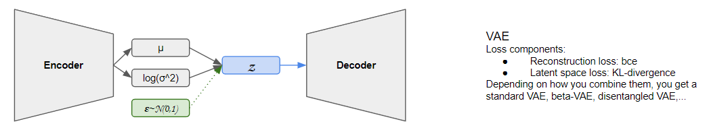
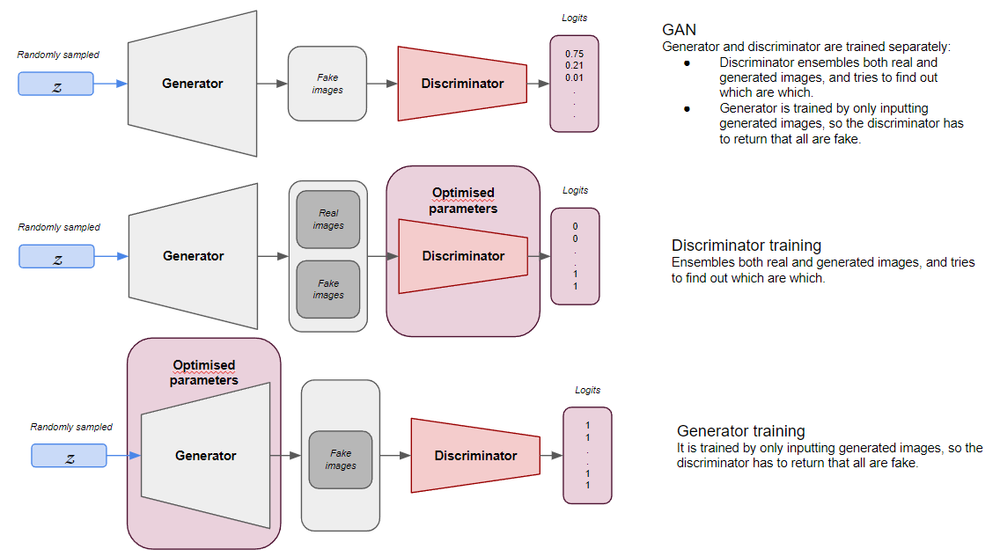

# Generative image models

---
## Table of contents
- [1. Introduction](#introduction)
- [2. Repo structure](#repo-structure)
- [3. Notions on generative models](#notions-on-generative-models)
- [4. How to use your own dataset](#use-your-own-dataset)
- [5. Quickstart code](#quickstart-code)
- [6. License](#license)
---

## Introduction
This repository provides an automated pipeline to train generative image models with "real-size" images, since most of the utilities that can be found are exemplified in playground datasets. With these tools, you will be able to manipulate standard-sized images (224) with custom encoders and decoders.

The main goals of this repository are:
* Designing an efficient pipeline that can handle custom datasets and configurations.
* Provide a baseline for generative image models.
* Elaborate a component-based code where different dependencies, requirements and setups are met and can be used as template.

## Repo structure
The repository has been divided in minimal components, for several reasons:

* Optimisation of the service.
* No need to go through all of them if it's out of the scope of your project. In this direction, it's important to mention that you can skip step I if you already provide your own dataset, under the code specifications.
* Easiness to extend to Cloud pipelines (k8s, Vertex AI in GCP,...)

Each of those contains a structure like the following one:

Click here to find out!

    ├── src                                         # Compiled files (alternatively `dist`)
    │   ├── dataset.py                              # Method that structures and transforms data
    │   ├── loss.py                                 # Custom function to meet our needs during training
    │   ├── layers.py                               # Auxiliary modules to build encoder and decoder
    │   ├── model.py                                # Core script containing the architecture of the model
    │   ├── fitter.py                               # Training wrapper
    │   └── ...         
    ├── input                                       # Configuration files, datasets,...
    │   ├── info.json                               # Configuration file for datasets information
    │   ├── model_config.json                       # Configuration file for model architecture (depth, style,...)
    │   ├── training_config.json                    # Configuration file for model training (batch_size, learning_rate,...)
    │   ├── wandb_config.json                       # Credentiales for Weights and Biases API usage
    │   ├── kaggle_config.json                      # Configuration file for Kaggle API (KAGGLE_USERNAME and KAGGLE_KEY)
    │   └── DATASET_NAME                            # Image dataset containing a folder structure
    │       ├── train 
    │       │   ├── class_1                     
    │       │   │   ├── image_1_class_1_train.png 
    │       │   │   ├── image_2_class_1_train.png              
    │       │   │   └── ...    
    │       │   ├── class_2              
    │       │   │   ├── image_1_class_2_train.png 
    │       │   │   ├── image_2_class_2_train.png              
    │       │   │   └── ...   
    │       │   └── ...
    │       └── val
    │           ├── class_1                     
    │           │   ├── image_1_class_1_val.png 
    │           │   ├── image_2_class_1_val.png              
    │           │   └── ...    
    │           ├── class_2              
    │           │   ├── image_1_class_2_val.png 
    │           │   ├── image_2_class_2_val.png              
    │           │   └── ...   
    │           └── ...
    ├── main.py                                     # Main script to run the code of the component
    ├── Dockerfile                                  # Docker code to build an image encapsulating the main.py code
    └── requirements.txt                            # Docker code to build an image encapsulating the code

## Notions on generative models

Currently, VAEs and GANs are supported. To have a quick outlook of how these models look like and how are they trained, check the following images:

* VAE: Current avilable versions are original VAE ([paper](https://arxiv.org/abs/1312.6114)), beta-VAE ([paper](https://openreview.net/forum?id=Sy2fzU9gl)) and disentangled beta-VAE ([paper](https://arxiv.org/abs/1804.03599)). Also, pixelwise and perceptual (inspired in this [paper](https://arxiv.org/abs/1603.08155)) losses can be chosen.

* GAN: Current implementation follows the approach introduced in *Improved Training of Wasserstein GANs* ([paper](https://proceedings.neurips.cc/paper/2017/hash/892c3b1c6dccd52936e27cbd0ff683d6-Abstract.html)).

## Use your own dataset
All the components make use of a specific dictionary that can be found in the `input` folder named `info.json`. Its keys are the names of the datasets that are to be specified in each `main.py` script as the `data_flag` parameter, and the values are also dictionaries containing relevant information. The necessary ones are:

Click here to find out!

    
    ├── img_size            # Size to which images will be resized.
    ├── python_class        # Name of the folder in which resized images will be stored.
    ├── url                 # Link where to download a `.zip` file containing a folder names as the previous parameter, and a folder structured as specified.
    ├── label               # Dictionary with containing numeric labels as keys and names of classes in folder structure as respective values.
    ├── n_channels          # 1 if images are grayscale or 3 if images are RGB.
    └── n_samples           # Dictionary with train-val folders as keys, and number of images in each as values.
    

Plus, you have the option to use the Kaggle API to store your datasets. To do so, you should:

* Update the `kaggle_config.json` file with your own `KAGGLE_USERNAME` and `KAGGLE_KEY` parameters.
* Put your dataset with the specified structure in a zip file named as the `data_flag` parameter.
* Update the `info.json` parameters with all the information, assigning to `python_class` the name of the folder inside the zip (`DATASET_NAME`).

By specifying those parameters, you should be ready to follow the steps contained in the next section. On it, we will make use of the already prepared [birds400 dataset](https://www.kaggle.com/datasets/antoniozarauzmoreno/birds400) (make sure you clone it to your Kaggle account before using it). If data has already been downloaded, unzipped and stored in the `input` folder, you can ignore the Kaggle credentials.

## Quickstart code
You can start by using this notebook  in which you can easily get up-to-speed with your own data and customise parameters.

## License
Released under [MIT](/LICENSE) by [@hedrergudene](https://github.com/hedrergudene).
